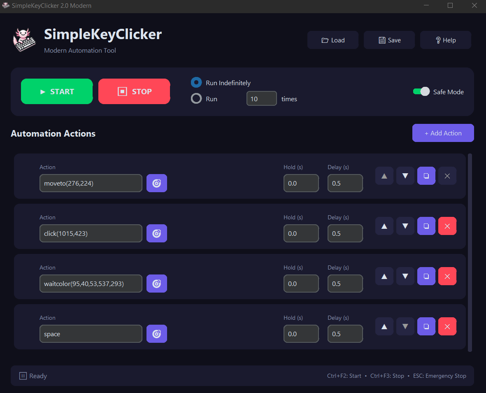

# SimpleKeyClicker

A powerful and user-friendly GUI automation tool for simulating keyboard and mouse inputs. Built with Python and **CustomTkinter** for a stunning modern dark UI. Perfect for gaming macros, testing, or automating repetitive input tasks.



## ✨ Features

- 🎮 **Action Sequencing**: Create and run sequences of keyboard presses and mouse actions
- ⏱️ **Customizable Timing**: Set delays after each action and hold durations for keys/buttons
- 🔄 **Repetition Control**: Run sequences indefinitely or for a specific number of times
- 🌙 **Modern Dark UI**: Beautiful glassmorphism dark theme with purple accents
- 🖱️ **Advanced Mouse Control**: Click and move at specific coordinates (`moveto(x,y)`, `click(x,y)`)
- 🎯 **Coordinate/Color Capture**: Built-in tool to capture mouse position and pixel color
- 🎨 **Color Detection**: Wait for specific colors at designated coordinates (`waitcolor`)
- ⌨️ **Reliable Typing**: Type strings accurately with proper case handling
- 💾 **Save/Load Configurations**: Export and import your automation sequences as JSON
- 🛡️ **Safety Features**: Safe Mode blocks dangerous keys, ESC for emergency stop
- 💡 **Visual Feedback**: Active row highlighting and status indicators during execution
- ⌨️ **Global Hotkeys**: Ctrl+F2 (Start), Ctrl+F3 (Stop), ESC (Emergency Stop)

## 📥 Download

**[Download the latest Windows EXE here](https://github.com/timoinglin/SimpleKeyClicker/releases/latest)**

Or build from source (see below).

## 🚀 Installation

### Prerequisites
- Python 3.8+

### Setup

1. **Clone the repository**:
   ```bash
   git clone https://github.com/timoinglin/SimpleKeyClicker.git
   cd SimpleKeyClicker
   ```

2. **Create and activate virtual environment**:
   ```bash
   python -m venv .venv
   # Windows:
   .venv\Scripts\activate
   # macOS/Linux:
   # source .venv/bin/activate
   ```

3. **Install dependencies**:
   ```bash
   pip install -r requirements.txt
   ```

4. **Run the application**:
   ```bash
   python main.py
   ```

## 🔨 Building the EXE

To create a standalone executable:

```bash
pip install pyinstaller
pyinstaller --onefile --windowed --icon=logo.ico --add-data "logo.ico;." --add-data "logo.png;." --name "SimpleKeyClicker" main.py
```

The EXE will be created in the `dist/` folder.

## 📖 Quick Start

1. Click **"+ Add Action"** to create steps for your sequence
2. For each row:
   - Enter a **Key/Button** or command (see Available Actions below)
   - Use the **🎯** button to capture coordinates/colors
   - Set **Hold Time** (how long to hold the key/button)
   - Set **Delay** (pause after the action)
3. Use **▲ ▼ ❏ ✕** buttons to organize rows
4. Select run mode: **Indefinitely** or **X Times**
5. Click **▶ START** or press `Ctrl+F2`
6. Click **⏹ STOP** or press `Ctrl+F3` / `ESC` to halt

## ⌨️ Available Actions

### Keyboard
| Action | Description |
|--------|-------------|
| `a`, `b`, `1`, `2` | Single key press |
| `space`, `enter`, `tab`, `esc` | Special keys |
| `up`, `down`, `left`, `right` | Arrow keys |
| `f1` - `f12` | Function keys |
| `shift`, `ctrl`, `alt`, `win` | Modifier keys (use Hold Time) |
| `Hello World!` | Type text string |

### Mouse
| Action | Description |
|--------|-------------|
| `click` | Left click at current position |
| `rclick` | Right click at current position |
| `mclick` | Middle click at current position |
| `click(x,y)` | Left click at coordinates |
| `rclick(x,y)` | Right click at coordinates |
| `moveto(x,y)` | Move cursor to coordinates |

### Color Detection
| Action | Description |
|--------|-------------|
| `waitcolor(r,g,b,x,y)` | Wait until color RGB appears at (x,y) |

## 🛡️ Safety Features

### Safe Mode (On by default)
- Blocks potentially dangerous keys: `alt`, `ctrl`, `shift`, `win`, `f4`, `delete`, `tab`
- Toggle via the switch in the control panel

### Emergency Stop
- Press `ESC` at any time to immediately halt automation

### Global Hotkeys
| Hotkey | Action |
|--------|--------|
| `Ctrl+F2` | Start automation |
| `Ctrl+F3` | Stop automation |
| `ESC` | Emergency stop |

## 📦 Requirements

- Python 3.8+
- customtkinter>=5.2.0
- keyboard>=0.13.5
- PyDirectInput>=1.0.4
- pyautogui>=0.9.54
- Pillow>=10.0.0
- pynput>=1.8.1

## 🤝 Contributing

Contributions are welcome! Feel free to submit issues and pull requests.

## 📄 License

MIT License - Copyright (c) 2025 Timo Inglin

See [LICENSE](LICENSE) for details.

## 🙏 Acknowledgments

- Modern UI built with **CustomTkinter**
- Input simulation by **PyDirectInput** and **PyAutoGUI**
- Screen capture via **Pillow (PIL)**
- Global hotkeys by **keyboard**
- Mouse capture by **pynput**