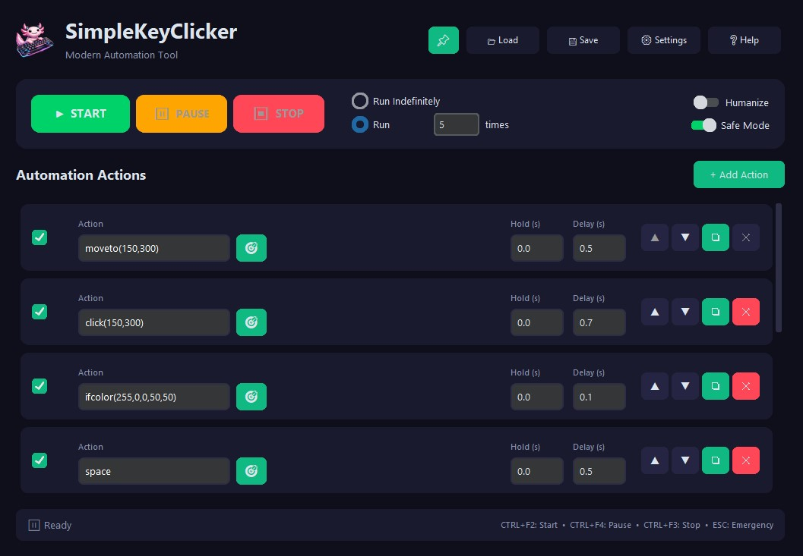

# SimpleKeyClicker

[](https://github.com/timoinglin/SimpleKeyClicker/releases)
[](https://github.com/timoinglin/SimpleKeyClicker/releases/latest)
[](LICENSE)
[](https://python.org)
[](https://github.com/timoinglin/SimpleKeyClicker/releases)

A powerful and user-friendly GUI automation tool for simulating keyboard and mouse inputs. Built with Python and **CustomTkinter** for a stunning modern dark UI. Perfect for gaming macros, testing, or automating repetitive input tasks.



## Features

**Input that registers in games**
- Actions are sent via **PyDirectInput** (SendInput / scancodes), so clicks, moves and drags work inside games
- Click, move and drag at exact screen coordinates
- **Humanize**: optional curved, eased, jittered mouse paths instead of instant teleports

**Sequences**
- Build a list of actions and run it top to bottom
- **Times**: repeat a single row N times before moving to the next one
- `repeat(N)` … `endrepeat` blocks (nestable) to repeat a group of rows
- `ifcolor` / `ifnotcolor` conditionals
- Enable or disable any row without deleting it

**Timing**
- Hold duration and delay per action, including random ranges like `0.3-0.8`
- Run the sequence indefinitely or a set number of times
- Configurable color-wait timeout — including **wait forever**

**Color**
- Capture coordinates and pixel color with a single click
- `waitcolor` blocks until a color appears; `ifcolor` / `ifnotcolor` branch on it

**While it runs**
- Live loop and action counters, elapsed time, CPS, plus ETA and a progress bar for limited runs
- Pause and resume from the same step
- Global hotkeys for Start, Pause, Stop and Emergency Stop — all customizable

**Everyday comfort**
- Modern dark UI with 7 selectable accent colors and an always-on-top pin
- Save and load sequences as JSON; your last session auto-restores on launch
- Inline validation flags bad timing/action fields before you run
- Safe Mode blocks dangerous keys by default

## Download

**[Download the latest Windows EXE here](https://github.com/timoinglin/SimpleKeyClicker/releases/latest)**

Or build from source (see below).

> 💛 **Using SimpleKeyClicker?** It's free and open-source, built and maintained in spare time. If it's saved you time on repetitive input tasks — or you'd like to see it keep growing — a coffee genuinely helps. See [Support the Project](#support-the-project).
>
> [](https://ko-fi.com/kneuma)

## Installation

### Prerequisites
- Python 3.8+

### Setup

1. **Clone the repository**:
   ```bash
   git clone https://github.com/timoinglin/SimpleKeyClicker.git
   cd SimpleKeyClicker
   ```

2. **Create and activate virtual environment**:
   ```bash
   python -m venv .venv
   # Windows:
   .venv\Scripts\activate
   # macOS/Linux:
   # source .venv/bin/activate
   ```

3. **Install dependencies**:
   ```bash
   pip install -r requirements.txt
   ```

4. **Run the application**:
   ```bash
   python main.py
   ```

## Building the EXE

To create a standalone executable:

```bash
pip install pyinstaller
pyinstaller --onefile --windowed --icon=logo.ico --add-data "logo.ico;." --add-data "logo.png;." --name "SimpleKeyClicker" main.py
```

The EXE will be created in the `dist/` folder.

## Quick Start

1. Click **"+ Add Action"** to create steps for your sequence
2. For each row:
   - Enter a **Key/Button** or command (see Available Actions below)
   - Use the **🎯** button to capture coordinates/colors
   - Set **Hold Time** (how long to hold the key/button)
   - Set **Delay** (pause after the action; supports ranges like `0.3-0.8`)
   - Set **Times** (how often this row repeats before the next one; default `1`)
   - Untick the **checkbox** to temporarily skip a row
3. Use **▲ ▼ ❏ ✕** buttons to organize rows
4. Select run mode: **Indefinitely** or **X Times**
5. Click **▶ START** or press `Ctrl+F2`
6. **⏸ PAUSE** (`Ctrl+F4`) to pause/resume, **⏹ STOP** (`Ctrl+F3`) or `ESC` to halt

## Available Actions

### Keyboard
| Action | Description |
|--------|-------------|
| `a`, `b`, `1`, `2` | Single key press |
| `space`, `enter`, `tab`, `esc` | Special keys |
| `up`, `down`, `left`, `right` | Arrow keys |
| `f1` - `f12` | Function keys |
| `shift`, `ctrl`, `alt`, `win` | Modifier keys (use Hold Time) |
| `ctrl+c`, `alt+f4` | Key combos (modifiers held automatically) |
| `Hello World!` | Type text string |

### Mouse
| Action | Description |
|--------|-------------|
| `click` | Left click at current position |
| `rclick` | Right click at current position |
| `mclick` | Middle click at current position |
| `click(x,y)` | Left click at coordinates |
| `rclick(x,y)` | Right click at coordinates |
| `moveto(x,y)` | Move cursor to coordinates |
| `drag(x1,y1,x2,y2)` | Drag from point A to point B |

### Color Detection & Conditions
| Action | Description |
|--------|-------------|
| `waitcolor(r,g,b,x,y)` | Wait until color RGB appears at (x,y) |
| `waitcolor(r,g,b,x,y,120)` | Same, but give up after 120 seconds |
| `waitcolor(r,g,b,x,y,0)` | Same, but wait **forever** |
| `ifcolor(r,g,b,x,y)` | Run the **next** row only if the color matches |
| `ifnotcolor(r,g,b,x,y)` | Run the **next** row only if the color is absent |

### Control Flow
| Action | Description |
|--------|-------------|
| `repeat(N)` | Repeat the rows below this marker N times… |
| `endrepeat` | …up to this marker (blocks may be nested) |

### Timing
| Value | Description |
|-------|-------------|
| `0.5` | Fixed delay in seconds |
| `0.3-0.8` | Random delay between min and max |

### Row Repeats (Times)
| Value | Description |
|-------|-------------|
| `1` | Run the row once — the default |
| `25` | Run the row 25 times before moving to the next row |

Times applies to a single row, `repeat(N)` … `endrepeat` applies to a block of rows — and they nest, so a `Times: 3` row inside `repeat(2)` fires six times per pass. The row's Delay is applied after every repeat.

## Waiting for a Color

`waitcolor` blocks the sequence until the color shows up at those coordinates. By default it gives up after **30 seconds** and stops the run.

If you're waiting for something that may take hours — a popup, a queue, a respawn — open **⚙ Settings → Color wait** and set it to `0`. The sequence will then wait as long as it takes. A single action can override the setting with a sixth value: `waitcolor(r,g,b,x,y,600)` for ten minutes, `waitcolor(r,g,b,x,y,0)` for forever.

While it waits, `Ctrl+F3` (Stop) and `ESC` (Emergency Stop) still work — an endless wait is always interruptible.

## Safety Features

### Safe Mode (On by default)
- Blocks potentially dangerous keys: `alt`, `ctrl`, `shift`, `win`, `f4`, `delete`, `tab`
- Toggle via the switch in the control panel

### Emergency Stop
- Press `ESC` at any time to immediately halt automation

### Global Hotkeys
| Hotkey | Action |
|--------|--------|
| `Ctrl+F2` | Start automation (default) |
| `Ctrl+F4` | Pause / resume (default) |
| `Ctrl+F3` | Stop automation (default) |
| `ESC` | Emergency stop (default) |

> All hotkeys are fully customizable. Click **⚙ Settings** in the header to open the keybind editor, then click **⏺ Record** next to any hotkey and press your preferred key combination. Changes take effect immediately and are saved/loaded with your configuration files.

## Requirements

- Python 3.8+
- customtkinter>=5.2.0,<7
- keyboard>=0.13.5
- PyDirectInput>=1.0.4
- pyautogui>=0.9.54
- Pillow>=10.0.0
- pynput>=1.8.1

## Contributing

Contributions are welcome! Feel free to submit issues and pull requests.

## Support the Project

This project is free and open-source, built and maintained in spare time. If SimpleKeyClicker has saved you time — or you'd just like to see it keep growing — a coffee is hugely appreciated and helps keep this and other free tools maintained and improving.

[](https://ko-fi.com/kneuma)

Every contribution also funds more free open-source tools — thank you! 💛

## License

MIT License - Copyright (c) 2025 Timo Inglin

See [LICENSE](LICENSE) for details.

## Acknowledgments

- Modern UI built with **CustomTkinter**
- Input simulation by **PyDirectInput** and **PyAutoGUI**
- Screen capture via **Pillow (PIL)**
- Global hotkeys by **keyboard**
- Mouse capture by **pynput**
