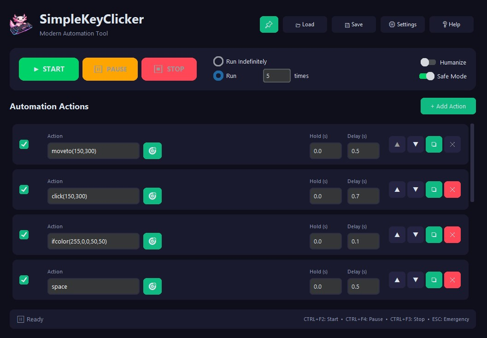

# SimpleKeyClicker


A powerful and user-friendly GUI automation tool for simulating keyboard and mouse inputs. Built with Python and **CustomTkinter** for a stunning modern dark UI. Perfect for gaming macros, testing, or automating repetitive input tasks.



---

## Key Features

*   **Game-Reliable Input**: Mouse/keyboard actions are sent via **PyDirectInput** (SendInput) so they register inside games.
*   **Action Sequencing**: Create and run sequences of keyboard presses and mouse actions.
*   **Control Flow**: `repeat(N)` … `endrepeat` loops and `ifcolor` / `ifnotcolor` conditionals.
*   **Per-Action Enable/Disable**: Mute any row without deleting it.
*   **Customizable Timing**: Delays *after* each action, hold durations, and random delay ranges (`0.3-0.8`).
*   **Humanize Movement**: Optional curved, eased, jittered mouse paths.
*   **Pause / Resume**: Pause mid-sequence and resume from the same step.
*   **Live Stats**: Loop/action counters, elapsed time, CPS, and an ETA + progress bar for limited runs.
*   **Theme Support**: Sleek dark UI with 7 selectable accent colors and an always-on-top pin.
*   **Advanced Mouse Control**: Clicks, moves and drags at specific screen coordinates.
*   **Coordinate/Color Capture**: Capture mouse coordinates (X,Y) and pixel color (R,G,B) with a single click.
*   **Color Detection**: Wait for or branch on a specific color at designated coordinates.
*   **Save/Load + Auto-Restore**: Save/Load sequences to JSON; your last session auto-restores on launch.
*   **Safety Features**: Toggleable Safe Mode and customizable Emergency Stop.
*   **Inline Validation**: Invalid timing/action fields are flagged before you run.
*   **Global Hotkeys**: Start (`Ctrl+F2`), Pause (`Ctrl+F4`), Stop (`Ctrl+F3`), Emergency Stop (`ESC`) — all customizable.

---

## Download

Get the latest release directly from the **[GitHub Releases Page](https://github.com/timoinglin/SimpleKeyClicker/releases/latest)**.

*(Look for the `.exe` file for Windows)*

---

## Quick Start

1.  Download and run the `.exe` file from the [latest release](https://github.com/timoinglin/SimpleKeyClicker/releases/latest).
2.  Click "**Add Row**" to create steps for your sequence.
3.  For each row:
    *   Enter a **Key/Button** or command (see **Help > Show Keys/Actions Info** in the app).
    *   Use "**Capture**" to easily get coordinates/colors for commands like `moveto`, `click(x,y)`, `waitcolor`.
    *   Set the **Hold Time** and **Delay**.
4.  Use the **▲**, **▼**, **❏**, **X** buttons on each row to organize your sequence.
5.  Select the desired **Run Mode**: "Run Indefinitely" or "Run X Times".
6.  **(Optional)** Click **💾 Save** to export your sequence (your session also auto-restores on next launch).
7.  Click "**Start**" or press `Ctrl+F2`.
8.  **Pause/resume** with `Ctrl+F4`; **Stop** with `Ctrl+F3` (or `ESC` for emergency stop).

---

## Building from Source (Optional)

1.  Ensure Python 3.7+ is installed.
2.  Clone the repository: `git clone https://github.com/timoinglin/SimpleKeyClicker.git`
3.  Navigate to the directory: `cd SimpleKeyClicker`
4.  Create and activate a virtual environment (recommended):
    ```bash
    python -m venv venv
    # On Windows: venv\Scripts\activate
    # On macOS/Linux: source venv/bin/activate
    ```
5.  Install dependencies: `pip install -r requirements.txt`
6.  Run the application: `python main.py`

---

## Repository

Find the full source code and contribute on **[GitHub](https://github.com/timoinglin/SimpleKeyClicker)**. 